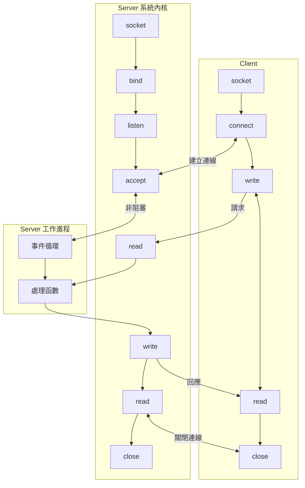

```mermaid
flowchart TD

    subgraph "Server 工作進程"
        sp[事件循環];
        sf[處理函數];

        sp --> sf;
    end

    subgraph Client;
        cs[socket];
        cn[connect];
        cw[write];
        cr[read];
        cc[close];

        cs --> cn;
        cn --> cw;
        cw <--> cr;
        cr --> cc;
    end

    subgraph "Server 系統內核";
        ss[socket];
        sb[bind];
        sl[listen];
        sa[accept];
        sr[read];
        sw[write];
        scr[read];
        sc[close];

        ss --> sb;
        sb --> sl;
        sl --> sa;
        cn <-- 建立連線 --> sa;
        sa <-- 非阻塞 --> sp;
        cw -- 請求 --> sr;
        sr --> sf;
        sf --> sw;
        sw -- 回應 --> cr;
        sw --> scr;
        scr <-- 關閉連線 --> cc;
        scr --> sc;
    end
```

