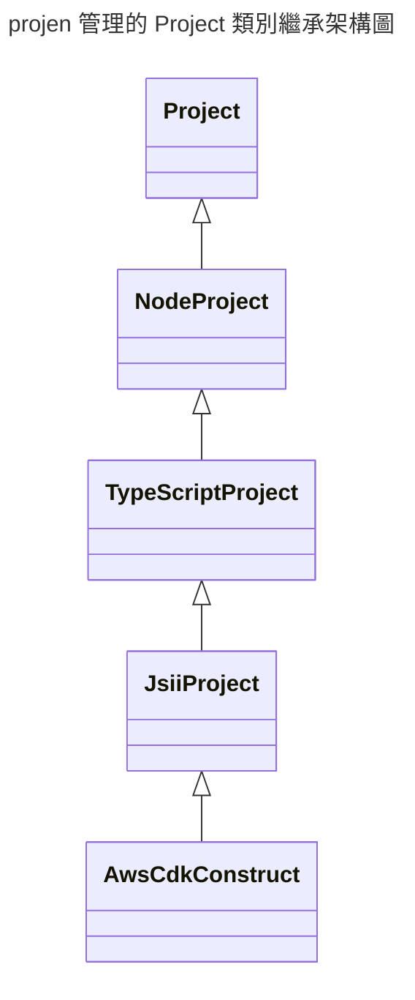

- https://www.cdkday.com/
- 名詞定義:
    - synthesize projects
        - 如 package.json, tsconfig.json, eslint, ... 這一堆有的沒有的設定檔
- 使用 `projen` 的話, 將來一律修改 `.projectrc.js`, 再藉由 `projen` CLI 來同步 **synthesize project files** 


------



------

```bash
### init
npx projen new demo


##
npx projen
# 可用來同步版本 (先修改 .projenrc.js, 再執行 CLI)


### 
npx projen build
# 起碼要寫一個 test 才能正常運行


### 
```
