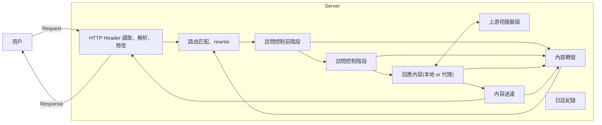

```mermaid
flowchart LR;

client["用戶"];
    subgraph Server
    http["HTTP Header 讀取、解析、修改"];
    route["路由匹配、rewrite"]
    pre["訪問控制前階段"]
    access["訪問控制階段"]
    forward["內部轉發"]
    res["回應內容(本地 or 代理)"]
    upstream["上游伺服器組"]
    filtering["內容過濾"]
    log["日誌紀錄"]
end

http --> route;
route --> pre;
pre --> access;
access --> res;
res --> filtering;
res <--> upstream;

pre --> forward;
access --> forward;
res --> forward;
filtering --> forward;
forward --> route;

client  -- Request --> http;
filtering --> http;
http  -- Response --> client;
```