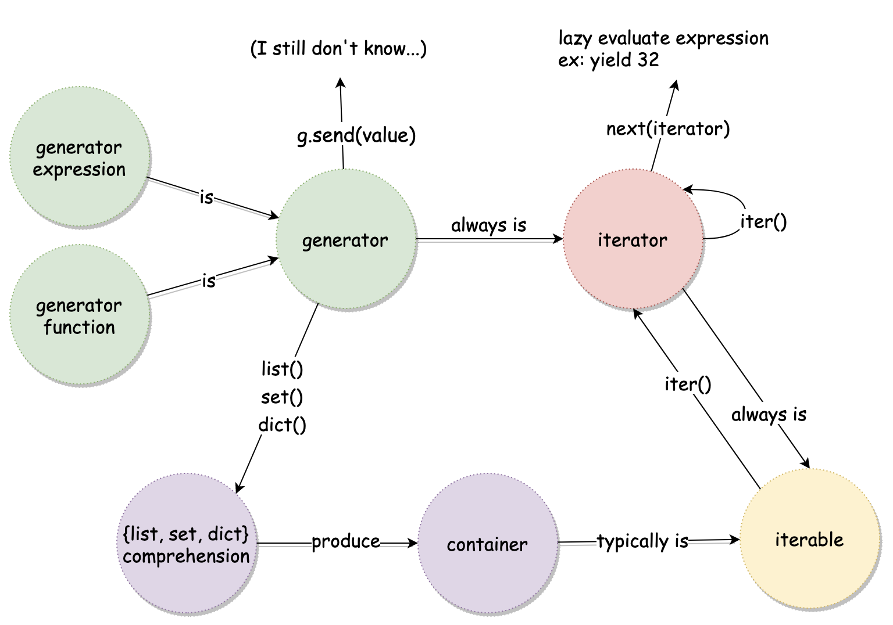

# Iterable, Iterator, Generator, Yield

- 2020/07/14
- python 3.7
- [What does the “yield” keyword do?](https://stackoverflow.com/questions/231767/what-does-the-yield-keyword-do/231855#231855)

# 摘要

要懂 yield 以前, 必須先懂 generator; 而要懂 generator 前, 必須先懂 iterable 及 iterator



# 名詞定義

## 1. Iterable (可被迭代的東西)

- Iterable 實作了 `__iter__()` && `__getitem__()`, 所以它可以被一個一個讀取出來
  - Iterable 範例:
    - Iterable 包含了但不限於 Sequence
    - Iterable 包含了實作了 `__iter__()` && `__getitem__()` 的 objects
- Sequence 實作了 `__len__()` && `__getitem__()`, 所以它是個 Iterable
  - Sequence 可藉由 int index 取得 Element, 並藉由 len 取得序列數量
  - Sequence 範例:
    - list
    - str
    - tuple
    - bytes
  - dict 歸屬於 mapping 而非 Sequence, 因為它尋找的並非 index, 而是 hashable keys
- 當你建立了一個 list, 你可以 '一個接一個' 讀取它內部的物件.
- '一個接一個' 讀取的過程, 稱之為 iteration(迭代).
- 可以被 '一個接一個' 讀取的東西, 就是個 Iterable.
- class 內定義了 `__iter()__`, 其 實例 就是個 Iterable. 如果 實例 狀態比較複雜, 可自行定義 `__iter()__` 來取得迭代器.
- `iterator = iter(iterator)`, 此為寡等操作

```py
mylist = [1, 2, 3]
for ii in mylist:   # 任何可以使用 for in 來逐一取值的東西, 就是個 iterable (string, list, set, dict, ...)
  print(ii)
```

使用上述範例的缺點就是, mylist 裡頭的東西需要載入到記憶體(他們可能非常非常非常的大...)

## 2. Iterator (迭代器物件)

- 假設 obj 是個 Iterable , 使用 `iter(obj)` 就可以取得 Iterator.
- Iterator 是個 Iterable.
- Iterator 之所以可以被 `iter(obj)`, 是因為它實作了 `__next__()`.
  - 將指標指向下一個, 讓下次可以繼續調用.
  - 返回當前結果.

## 3. Generator (產生器)

- Generator 是個較特殊的 Iterator, 同時它也是個 Iterable.
- Generator 本身不會把所有資料塞到記憶體, 取而代之的是, 它只在有需要的時候, 產生它所需要的值(此動作我們稱之為: **Lazy Evaluation 惰性求值**)
- 產生器函式(GF), 通常被用來建立 迭代器(Iterator)

```py
mygenr = (x for x in range(3))  # <generator object <genexpr> at 0x7ff92814f450>
for ii in mygenr:
  print(ii)
```

- Generator: 一種比較特殊的 Iterator(繼承), 但內部實作了 `yield` 與 `send()`

## 4. Yield

- yield 本身一定要寫在 function 裡頭, 此 function 稱之為 Generator Function (底下簡稱為 GF)
- yield 本身有點類似 return, 但相較於 return 回傳一個任意物件, yield 返回了一個 Generator.
  - GF 回傳的東西稱作: `迭代器物件(iterator object)`, 又稱作 `產生器物件(generator object)`, 也會被(讓人搞混的)稱作 `一個產生器(a generator)`
  - 上述的 `a generator`, 記錄了 **函式主體** && **區域變數** && **目前的執行位置(current point of execution)**
- GF 內部執行到 yield 那一行時, 程式的執行流程會 **返回** 呼叫 GF 的調用方, 等到下次再次調用 GF, 執行流程會回到上次 返回 的下一行開始.
  - `yield XXX`, 其實就是 `next(iterator)` 會拿到的值(也就是 XXX 啦)

```py
def gg():  # 裡面定義了 yield, 所以 gg() 是個 GF
  rr = range(3)
  for ii in rr:
    yield ii  # yield 返回的不是個 0, 1, 2 的物件, 而是 Generator

mm = gg()
print(mm)  # <generator object gg at 0x7fd9e8a29650>
for ii in mm:
  print(ii)  # 依序印出 0 1 2
```

## 彙整基礎範例

```python
# Iterable 與 Iterator
from collections import Iterable, Iterator
a = [1, 2, 3]
b = iter(a)  # <list_iterator object at 0x10b705890>

print(isinstance(a, Iterator))  # False
print(isinstance(b, Iterator))  # True
print(isinstance(a, Iterable))  # True
print(isinstance(b, Iterable))  # True

# 因為 a 是個 iterable, 所以透過 iter(a) 取得它的 Iterator
# 它可以透過 next(b) 一個一個慢慢取出來 (b 內部 container 儲存的值隱含著被 pop 掉了)
# 也可透過 list(b) 一口氣取出來 (b 內部 container 瞬間被抽乾)
c = list(b)     # [1, 2, 3]
d = list(b)     # []

b == None       # False. 被抽乾後, b 依舊是剛剛那個 <list_iterator object at 0x10b705890>

e = iter(a)     # <list_iterator object at 0x10b705850>
next(e)  # 1
next(e)  # 2
next(e)  # 3
next(e)  # Exception StopIteration
```

`for a in b` 的原理, 其實就是先調用 `iter(b)`, 取得 Iterator. 如此便可使用 next 方法, 一個一個叫出來處理, 直到 StopIteration. 另一種理解方式是, Python 會在 高層次上面去檢查 2 件事情:

- object 有無 `__next__()` or `__iter__()` 其中一種方法
- object 是不是 sequence && 同時擁有 `__len__()` and `__getitem__()`

## 再論 Generator (產生器, 生成器)

> `generator`: A function which returns a generator iterator. It looks like a normal function except that it contains yield expressions for producing a series of values usable in for-loop or that can be retrieved at a time with the next() function.
> `generator iterator`: An object created by a generator function.
> `generator expression`: An expression that returns an iterator.

自己理解的白話文:

- generator 就是個會 yield `generator iterator` 的 function. 也就上上面講的 GF
- generator iterator: 被 GF 回傳的東西
- 如果一個 function 裡面有 yield, 那麼這個 GF 就稱為 Generator, 它會透過 `yield` 返回 generator.

```python
# Generator
a = (elem for elem in [1, 2, 3])  # <generator object <genexpr> at 0x10b842950>

def fib():
  a, b = 0, 1
  while True:
    yield b
    a, b = b, a + b

g = fib()  # <generator object fib at 0x10b842850>
```

> Python's generators provide a convenient way to implement the iterator protocol.

因為 generator 就是個 iterator (得實作 `__iter__()` 與 `__next()__`). 但是 generator 只需要使用 `yield`, 它幫忙實現了 generator 的 `__next()__`.

```python
from typing import Generator, Iterable
# Generator 與 Iterator
def g():
  print('第1次')
  yield 1
  print('第2次')
  yield 2
  print('第3次')
  yield 3

f = g()  # <generator object g at 0x10b842850>
next(f)  # '第1次'  收到 1
next(f)  # '第2次'  收到 2
next(f)  # '第3次'  收到 3
next(f)  # StopIteration

isinstance(f, Iterable)   # True
isinstance(f, Generator)  # True
```

`generator` 在遇到了 yield 就將程式的`執行流程返回給了呼叫端` & `返回當前的值`. 下次進入的時候, 會接在上次中斷的地方繼續... 這樣的概念就如同 generator 的 `將指標指向下一個, 方便下次迭代` & `返回當前的值`

generator 的 yield 可理解成 `中斷服務子程序的斷點`. 爾後每次對 generator 調用 `next()` 時, 就會回到斷點之後繼續執行

# Itertools

- itertools 模組內, 有些特別的 function 可以用來方便操作 iterable.
