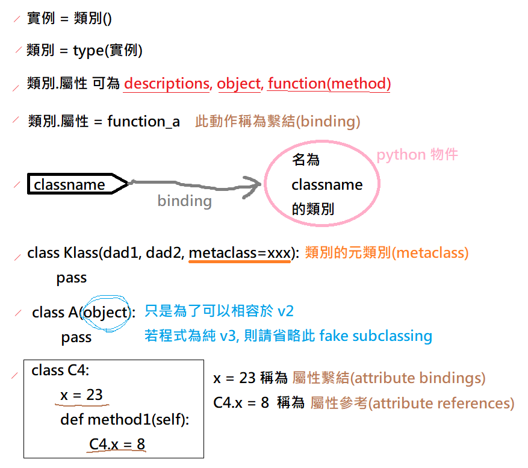

# Python 3

```bash
### 使用 doctest 這模組(or套件) 執行 abc.py, 並列出詳細執行情況
python -m doctest -v abc.py
```


## 零碎知識

- Dir 內如果有包含 `__init__.py` 的話, 這個 Dir 就被視為是一個 `package`, 如此一來就可以被 import
- object 為 class     的 instance ; class  為 metaclass 的 instance

> `type` is the usual metaclass in python, `type` is itself a class, and it is its own type.




## Shebang Line 與 Encoding

```py
#! /usr/bin/python
# coding: utf-8
```


## 環境變數

```py
### 比較兩個環境變數差異
import os
os.environ['PATH']
# 列出 echo ${PATH} 的東西

import sys
sys.path
# 列出目前 python 裡頭, 作引用時, 套件們的位置
```


## metaclass

- 2019/07/03
- [What are metaclasses in Python?](https://stackoverflow.com/questions/100003/what-are-metaclasses-in-python)


### 看了還是不懂

- 鴨子定型: duck typing
- 鵝定型法: goose typing (Python技術手冊 3ed p233)

```python
### 順序: arguments -> *args -> default -> **kwargs
def display_info(a, b, *args, name='Tony', **kwargs):
    return [a, b, args, name, kwargs]

display_info(1, 2, 3, lastname='Chou', job='Programmer')
# [1, 2, (3,), 'Tony', {'lastname': 'Chou', 'job': 'Programmer'}]

###
a = (1,2,3,4,5,6)
print(*a)   # 1 2 3 4 5 6
print(a)    # (1, 2, 3, 4, 5, 6)

### dictionary unpacking
def display_name(first, last):
    print(f'{first} {last}')

names={'first': 'chou', 'last': 'tony'}
display_name(**names)
​# chou tony
```


### configureParser

```py
### configureParser.py
import configparser

# 讀取外部組態檔
def getConfig(iniPath):
    config = configparser.ConfigParser()
    config.read(iniPath)
    dbhost = config.get('Section_A', 'sql_dbhost')
    user = config.get('Section_A', 'sql_id')
    passwd = config.get('Section_A', 'sql_pd')
    return dbhost, user, passwd
#

def mainFunction():
    iniPath = './house.ini'
    dbhost, user, passwd = getConfig(iniPath)
#
```

```ini
### house.ini
[Section_A]
sql_dbhost=localhost
sql_pport=3306
sql_id=tony
sql_pd=12345687

[Section_B]
# 放其他的...
```


# PYTHONPATH

```bash
### Linux
$# export PYTHONPATH=/path-to-module1_path:/path-to-module2_path

### Windows
$# set PYTHONPATH=C:/path-to-module1_path
```
